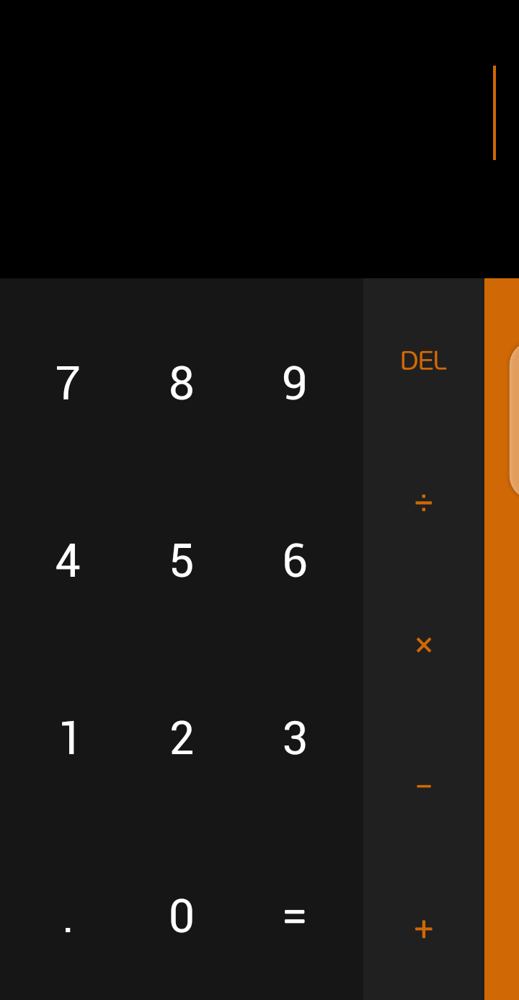

# Basic Calculator(Made With React)

I got really bored, and I decided to build a clone of my mobile's calculator.

I also used the opportunity to practice my React/JS skills.

Live version deployed at [Vercel](https://calculator-psi-five.vercel.app/)

### Here is a image of my work, and the original version

My Version:

Original Version:

